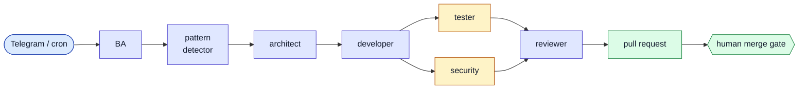

### Backend and platform engineer · Berlin

Twenty years in IT. I work on the depth of a running system rather than one
layer of it — the service, the platform underneath it, and the automation that
keeps both alive. The through-line in everything below is behaviour under
failure: what a system does when a dependency dies, a job double-starts, or a
model returns nonsense.

My commercial work is in **payments** at a large European bank — high-throughput,
multi-format payment processing. Before that, payroll, card and
regulatory-reporting systems in banking. That code is closed; what is public is
the other half — infrastructure, tooling and systems built in the open.

---

### What I work on

**Services** — Java and Spring, reactive where it earns its place: WebFlux,
R2DBC, Kafka, Liquibase, PostgreSQL. Domain work in payments, payroll and
regulatory reporting.

**Platform** — around 40 Terraform repositories for AWS: reusable modules for
EKS and node pools, Aurora/RDS Postgres, MySQL and Oracle, Kafka and
ActiveMQ/RabbitMQ, ElastiCache, Secrets Manager, IAM and KMS, ECR, remote state,
GitLab runners and EKS/EC2 monitoring — plus the per-service stacks built on top
of them. The operational glue is small Lambdas in Rust and Python: database
health probes, EC2 lifecycle control, secret rotation, IAM config generation.

**Systems and tooling** — Rust when the answer should be one fast self-contained
binary, Kotlin for Android TV, Rust/Anchor for Solana programs.

---

### Selected work

#### [ai-delivery](https://github.com/Sekator778/ai-delivery) &nbsp;

A self-hosted control plane over a coding agent. One Telegram message becomes a
full SDLC pipeline that opens a real pull request and stops at a human merge
gate:

It does not try to out-code the model; it owns the part that decides quality and
cost: routing, stop conditions, cost governance, crash recovery. Runs on a
single Linux host under systemd.

#### [chat-orchestrator](https://github.com/Sekator778/chat-orchestrator) &nbsp;

Reactive Spring Boot — WebFlux, R2DBC, Kafka, Liquibase — with a React panel,
for LLM-driven Telegram automation. Also the living showcase of ai-delivery: its
features were specified, implemented, tested and reviewed end to end by that
pipeline.

#### [foldlock](https://github.com/Sekator778/foldlock) &nbsp;

`tar | zstd | encrypt | split` collapsed into a single ~1 MB binary.
ChaCha20-Poly1305 in AEAD STREAM mode, keys derived with Argon2id and wiped on
drop, the archive header bound in as authenticated data — tampering, truncation
and block reordering are all detected. One command locks a folder into
fixed-size volumes, one brings it back.

#### [Anchor_1](https://github.com/Sekator778/Anchor_1) &nbsp; 

A Solana escrow program: make-offer / take-offer token exchange with vault-held
deposits. Alongside
[solana_boot_camp](https://github.com/Sekator778/solana_boot_camp) (devnet
tooling) and [binap_1](https://github.com/Sekator778/binap_1) (Binance market
data), this is where the on-chain side of my payments interest lives.

#### [OwnTV_Core](https://github.com/Sekator778/OwnTV_Core) &nbsp;

Not my project — a fork of an Android TV IPTV engine that drives a Philips
armeabi-v7a set at home. Device-specific tweaks stay in the fork; anything
generic goes back upstream as a pull request, most recently EPG channel-name
matching outside the Latin alphabet.

---

### How I approach it

- **Failure modes are the specification.** Every policy in ai-delivery's control
  loop exists because something actually broke: a double-spawn race became an
  authoritative `flock`, a review nitpick loop became a convergence check, and
  "timeout" stopped being treated as "crash".
- **Fix it where it belongs.** Local hacks stay local; anything generic becomes a
  patch against the upstream project.
- **Infrastructure is a product.** Versioned modules with real inputs, not stacks
  copy-pasted between environments.

---

Berlin · [Telegram](https://t.me/Sekator778)
